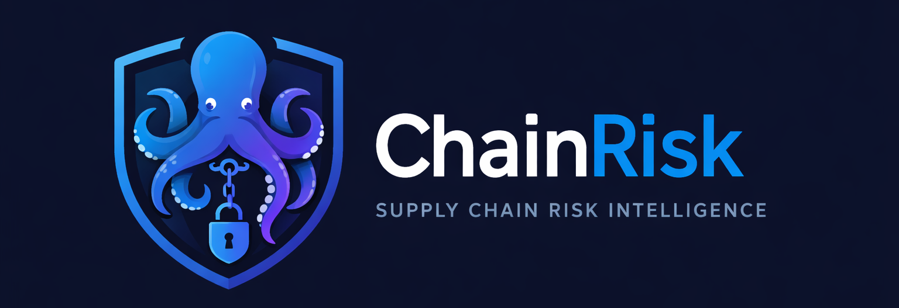

# ChainRisk

<p align="center">
  
</p>

<p align="center">
  <strong>ChainRisk is a CLI tool for analyzing software supply chain risk using SBOMs.</strong>
</p>

---

## overview

ChainRisk helps developers and security engineers understand how software dependencies are connected and how risk propagates through them.

Instead of focusing only on known vulnerabilities, ChainRisk answers a more practical question:

> **If one dependency is compromised, what breaks?**

---

## Why ChainRisk

Modern systems rely on deep dependency chains:

```
Application
   ↓
Libraries
   ↓
Transitive Dependencies
```

A failure in a low-level dependency can impact multiple services and systems.

ChainRisk helps you:

* understand dependency relationships
* visualize how components are connected
* simulate how failures propagate across systems

---

## Features (v0.1)

### 📊 SBOM Analysis

Parse SBOM files to extract package and dependency information.

```bash
chainrisk sbom-info <file>
```

Example:

```bash
chainrisk sbom-info testdata/sample.json
```

Output:

```
📊 SBOM INFO

📦 Total Packages: 3

🔗 Dependency Graph:

  • protobuf → zlib
  • grpc → protobuf
```

---

### 🔗 Dependency Graph

Build a directed dependency graph from SBOM relationships.

* models dependencies between components
* identifies how packages are connected
* forms the foundation for risk analysis

---

### 🚨 Blast Radius Analysis

Simulate the impact of a compromised dependency.

```bash
chainrisk blast <file> --target=zlib
```

Example:

```bash
chainrisk blast testdata/sample.json --target=zlib
```

### Output:

```
🚨 BLAST RADIUS

🎯 Target: zlib

📦 Affected Components:
  • zlib
  • protobuf
  • grpc

⚡ Total Impact: 3 components
```

---

## CLI Usage

```bash
chainrisk version
chainrisk sbom-info <file>
chainrisk blast <file> --target=<dependency>
```

---

## Installation

### Using Go (recommended)

```bash
go install github.com/jijo-OO7/chainrisk/cmd/chainrisk@latest
```

---

### From source

```bash
git clone https://github.com/jijo-OO7/chainrisk.git
cd chainrisk
go build -o chainrisk ./cmd/chainrisk
```

Run:

```bash
./chainrisk
```

---

## Project Structure

```
cmd/chainrisk       → CLI entry point  
internal/sbom       → SBOM parsing logic  
internal/graph      → dependency graph construction  
internal/cli        → command handlers  
testdata/           → sample SBOM files  
```

---

## Roadmap (Post v0.1)

* dependency centrality detection
* blast radius depth / levels
* risk scoring model
* CI/CD integration
* support for multiple SBOM formats (SPDX, CycloneDX)

---

## Version

**Current Version: v0.1.0**

This release focuses on:

* SBOM parsing
* dependency graph construction
* blast radius simulation

Future versions will expand into deeper risk analysis and production-grade capabilities.

---

## License

Licensed under the Apache License 2.0.

---

## Author

Suman Mandal
GitHub: https://github.com/jijo-OO7
